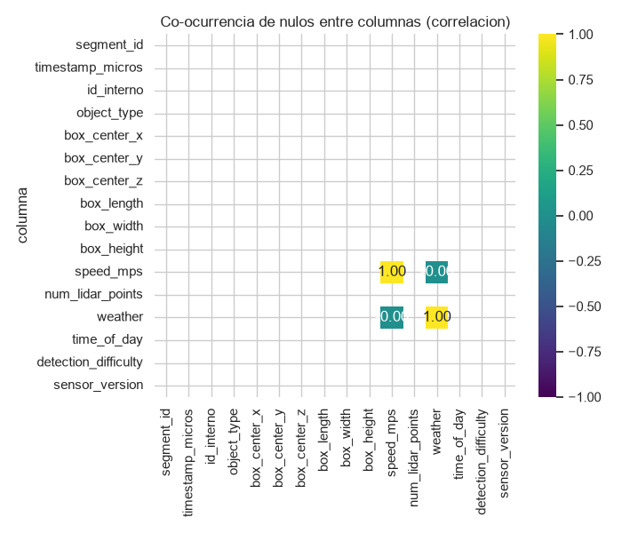
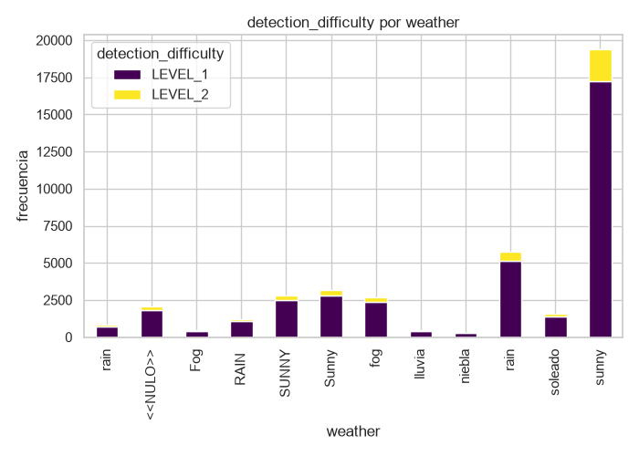
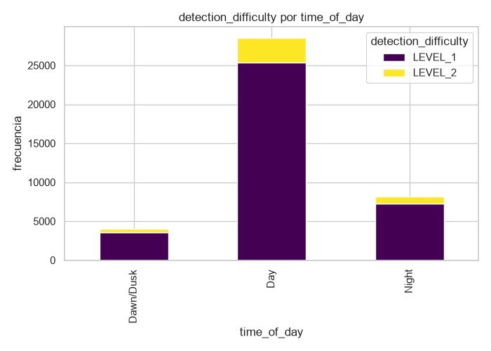

# Reporte de EDA - detecciones_waymo_like

## Fuente de datos

- Archivo: `data/01_raw/detecciones_waymo_like.csv`
- Filas: 40680
- Columnas: 16
- Naturaleza: tabla sintetica de detecciones estilo Waymo (no es el Waymo Open Dataset real; no incluye imagenes, camaras ni tfrecords).

## Dimensiones y esquema

Forma: 40680 filas x 16 columnas.

| columna | dtype | n_filas | n_nulos | pct_nulos | n_unicos | min | max | media | mediana | std | p1 | p99 | n_no_numericos | top_10_valores |
| --- | --- | --- | --- | --- | --- | --- | --- | --- | --- | --- | --- | --- | --- | --- |
| segment_id | str | 40680 | 0 | 0.0 | 153 | nan | nan | nan | nan | nan | nan | nan | nan | seg_0152 (304); seg_0036 (303); seg_0005 (302); seg_0000 (300); seg_0077 (297); seg_0016 (296); seg_0099 (295); seg_0093 (295); seg_0034 (292); seg_0107 (291) |
| timestamp_micros | str | 40680 | 0 | 0.0 | 22304 | 1691000000000000.0 | 1694800019900000.0 | 1692896206357678.2 | 1692900009600000.0 | 1105080119776.4587 | 1691025006900000.0 | 1694775012381000.0 | 60.0 | nan |
| id_interno | str | 40680 | 0 | 0.0 | 40000 | nan | nan | nan | nan | nan | nan | nan | nan | det_0024067 (2); det_0028649 (2); det_0017865 (2); det_0028457 (2); det_0015717 (2); det_0026222 (2); det_0013073 (2); det_0030722 (2); det_0033311 (2); det_0028842 (2) |
| object_type | str | 40680 | 0 | 0.0 | 7 | nan | nan | nan | nan | nan | nan | nan | nan | VEHICLE (25111); PEDESTRIAN (9134); SIGN (3303); Pedestrian (1069); PEATON (811); CYCLIST (789); Ped (463) |
| box_center_x | float64 | 40680 | 0 | 0.0 | 31602 | -72.265 | 107.662 | 18.083233456243853 | 18.2035 | 22.023089254836712 | -32.94877 | 69.70231 | 0.0 | nan |
| box_center_y | float64 | 40680 | 0 | 0.0 | 26332 | -46.918 | 50.619 | -0.007237143559488699 | -0.0945 | 11.960241180524823 | -27.7472 | 27.76124999999998 | 0.0 | nan |
| box_center_z | float64 | 40680 | 0 | 0.0 | 2293 | -0.678 | 2.769 | 0.898604646017699 | 0.898 | 0.3981125673433957 | -0.02320999999999998 | 1.8182099999999992 | 0.0 | nan |
| box_length | float64 | 40680 | 0 | 0.0 | 5745 | -13.784 | 17.998 | 3.303947468043264 | 3.99 | 2.430856333231866 | 0.27479000000000003 | 14.195419999999999 | 0.0 | nan |
| box_width | float64 | 40680 | 0 | 0.0 | 2419 | 0.2 | 2.9 | 1.4558274090462144 | 1.725 | 0.6233073936785953 | 0.287 | 2.574 | 0.0 | nan |
| box_height | float64 | 40680 | 0 | 0.0 | 2299 | 0.0 | 3.598 | 1.6958925516224188 | 1.676 | 0.3471352217056142 | 1.0267899999999999 | 3.1402099999999993 | 0.0 | nan |
| speed_mps | float64 | 40680 | 787 | 1.9346 | 14880 | 0.0 | 338.386 | 7.397143659288597 | 5.35 | 17.185421465738653 | 0.0 | 21.28808 | 0.0 | nan |
| num_lidar_points | int64 | 40680 | 0 | 0.0 | 775 | -1.0 | 933.0 | 134.8098820058997 | 96.0 | 121.15543624306714 | -1.0 | 591.2099999999991 | 0.0 | nan |
| weather | str | 40680 | 2075 | 5.1008 | 11 | nan | nan | nan | nan | nan | nan | nan | nan | sunny (19374); rain (5761); Sunny (3179); SUNNY (2821); fog (2664); <<NULO>> (2075); soleado (1567); RAIN  (1186);  rain (836); Fog (476) |
| time_of_day | str | 40680 | 0 | 0.0 | 3 | nan | nan | nan | nan | nan | nan | nan | nan | Day (28494); Night (8139); Dawn/Dusk (4047) |
| detection_difficulty | str | 40680 | 0 | 0.0 | 2 | nan | nan | nan | nan | nan | nan | nan | nan | LEVEL_1 (36165); LEVEL_2 (4515) |
| sensor_version | str | 40680 | 0 | 0.0 | 1 | nan | nan | nan | nan | nan | nan | nan | nan | v2.0.1 (40680) |

## Calidad de datos

### Duplicados

| chequeo | conteo | porcentaje |
| --- | --- | --- |
| filas_exactas_duplicadas | 960 | 2.3599 |
| duplicados_por_clave_natural(segment_id,timestamp_micros,id_interno) | 1360 | 3.3432 |

### Valores fisicamente imposibles

| chequeo | conteo | porcentaje |
| --- | --- | --- |
| box_length <= 0 | 80 | 0.1967 |
| box_width <= 0 | 0 | 0.0 |
| box_height <= 0 | 122 | 0.2999 |
| speed_mps <= 0 | 3236 | 7.9548 |
| num_lidar_points < 0 | 1198 | 2.9449 |

### Valores no numericos en columnas numericas (sentinels)

| chequeo | conteo | porcentaje |
| --- | --- | --- |
| timestamp_micros: valores no parseables como numero (sentinel de texto) | 60 | 0.1475 |

### Consistencia temporal por segmento

Segmentos distintos: 153. Frames por segmento: minimo 225, maximo 304, media 265.88.

## Inconsistencias categoricas

Valores crudos tal como aparecen en el CSV (sin normalizar) y la propuesta de mapeo a una categoria canonica. Ningun mapeo fue aplicado a los datos.

### object_type

| valor_crudo | frecuencia | pct | mapeo_sugerido |
| --- | --- | --- | --- |
| VEHICLE | 25111 | 61.7281 | VEHICLE |
| PEDESTRIAN | 9134 | 22.4533 | PEDESTRIAN |
| SIGN | 3303 | 8.1195 | SIGN |
| Pedestrian | 1069 | 2.6278 | PEDESTRIAN |
| PEATON | 811 | 1.9936 | PEDESTRIAN |
| CYCLIST | 789 | 1.9395 | CYCLIST |
| Ped | 463 | 1.1382 | PEDESTRIAN |

### weather

| valor_crudo | frecuencia | pct | mapeo_sugerido |
| --- | --- | --- | --- |
| sunny | 19374 | 47.6254 | SUNNY |
| rain | 5761 | 14.1618 | RAIN |
| Sunny | 3179 | 7.8147 | SUNNY |
| SUNNY | 2821 | 6.9346 | SUNNY |
| fog | 2664 | 6.5487 | FOG |
| <<NULO>> | 2075 | 5.1008 | sin propuesta: valor nulo |
| soleado | 1567 | 3.852 | SUNNY |
| RAIN  | 1186 | 2.9154 | RAIN |
|  rain | 836 | 2.0551 | RAIN |
| Fog | 476 | 1.1701 | FOG |
| lluvia | 453 | 1.1136 | RAIN |
| niebla | 288 | 0.708 | FOG |

### time_of_day

| valor_crudo | frecuencia | pct | mapeo_sugerido |
| --- | --- | --- | --- |
| Day | 28494 | 70.0442 | DAY |
| Night | 8139 | 20.0074 | NIGHT |
| Dawn/Dusk | 4047 | 9.9484 | DAWN_DUSK |

### detection_difficulty

| valor_crudo | frecuencia | pct | mapeo_sugerido |
| --- | --- | --- | --- |
| LEVEL_1 | 36165 | 88.9012 | LEVEL_1 |
| LEVEL_2 | 4515 | 11.0988 | LEVEL_2 |

### sensor_version

| valor_crudo | frecuencia | pct | mapeo_sugerido |
| --- | --- | --- | --- |
| v2.0.1 | 40680 | 100.0 | revisar manualmente: sin sinonimo conocido para 'V2.0.1' |

## Analisis de nulos

| columna | n_nulos | pct_nulos |
| --- | --- | --- |
| speed_mps | 787 | 1.9346 |
| weather | 2075 | 5.1008 |

Matriz de co-ocurrencia de nulos (correlacion entre indicadores de nulo por columna; valores cercanos a 1 indican que dos columnas faltan juntas, lo que apunta a MAR/MNAR en vez de MCAR):

| columna | segment_id | timestamp_micros | id_interno | object_type | box_center_x | box_center_y | box_center_z | box_length | box_width | box_height | speed_mps | num_lidar_points | weather | time_of_day | detection_difficulty | sensor_version |
| --- | --- | --- | --- | --- | --- | --- | --- | --- | --- | --- | --- | --- | --- | --- | --- | --- |
| segment_id | - | - | - | - | - | - | - | - | - | - | - | - | - | - | - | - |
| timestamp_micros | - | - | - | - | - | - | - | - | - | - | - | - | - | - | - | - |
| id_interno | - | - | - | - | - | - | - | - | - | - | - | - | - | - | - | - |
| object_type | - | - | - | - | - | - | - | - | - | - | - | - | - | - | - | - |
| box_center_x | - | - | - | - | - | - | - | - | - | - | - | - | - | - | - | - |
| box_center_y | - | - | - | - | - | - | - | - | - | - | - | - | - | - | - | - |
| box_center_z | - | - | - | - | - | - | - | - | - | - | - | - | - | - | - | - |
| box_length | - | - | - | - | - | - | - | - | - | - | - | - | - | - | - | - |
| box_width | - | - | - | - | - | - | - | - | - | - | - | - | - | - | - | - |
| box_height | - | - | - | - | - | - | - | - | - | - | - | - | - | - | - | - |
| speed_mps | - | - | - | - | - | - | - | - | - | - | 1.0 | - | -0.0001 | - | - | - |
| num_lidar_points | - | - | - | - | - | - | - | - | - | - | - | - | - | - | - | - |
| weather | - | - | - | - | - | - | - | - | - | - | -0.0001 | - | 1.0 | - | - | - |
| time_of_day | - | - | - | - | - | - | - | - | - | - | - | - | - | - | - | - |
| detection_difficulty | - | - | - | - | - | - | - | - | - | - | - | - | - | - | - | - |
| sensor_version | - | - | - | - | - | - | - | - | - | - | - | - | - | - | - | - |

## Outliers

Conteos por metodo; ninguna fila fue marcada para borrado.

| categoria | chequeo | conteo | porcentaje |
| --- | --- | --- | --- |
| outliers_iqr | timestamp_micros | 0 | 0.0 |
| outliers_zscore | timestamp_micros | 0 | 0.0 |
| outliers_iqr | box_center_x | 271 | 0.6662 |
| outliers_zscore | box_center_x | 103 | 0.2532 |
| outliers_iqr | box_center_y | 298 | 0.7325 |
| outliers_zscore | box_center_y | 117 | 0.2876 |
| outliers_iqr | box_center_z | 263 | 0.6465 |
| outliers_zscore | box_center_z | 107 | 0.263 |
| outliers_iqr | box_length | 633 | 1.556 |
| outliers_zscore | box_length | 651 | 1.6003 |
| outliers_iqr | box_width | 0 | 0.0 |
| outliers_zscore | box_width | 0 | 0.0 |
| outliers_iqr | box_height | 2371 | 5.8284 |
| outliers_zscore | box_height | 927 | 2.2788 |
| outliers_iqr | speed_mps | 180 | 0.4425 |
| outliers_zscore | speed_mps | 157 | 0.3859 |
| outliers_iqr | num_lidar_points | 2545 | 6.2561 |
| outliers_zscore | num_lidar_points | 864 | 2.1239 |

## Analisis de candidatos a variable objetivo

### detection_difficulty

| clase | conteo | pct |
| --- | --- | --- |
| LEVEL_1 | 36165 | 88.9012 |
| LEVEL_2 | 4515 | 11.0988 |

Ratio de desbalance (mayoritaria/minoritaria): **8.01** (LEVEL_1=36165 vs LEVEL_2=4515).

Asociacion con otras variables (Cramer's V; 0=independiente, 1=asociacion perfecta):

| variable_cruzada | chi2 | cramers_v | n |
| --- | --- | --- | --- |
| weather | 4.9502 | 0.011 | 40680 |
| time_of_day | 1.3933 | 0.0059 | 40680 |
| object_type | 5.5073 | 0.0116 | 40680 |

Estadisticos numericos por clase de `detection_difficulty`:

| clase | columna_numerica | min | max | media | mediana | std |
| --- | --- | --- | --- | --- | --- | --- |
| LEVEL_1 | timestamp_micros | 1691000000000000.0 | 1694800019900000.0 | 1692896227228663.5 | 1692900009600000.0 | 1104112474179.571 |
| LEVEL_2 | timestamp_micros | 1691000000100000.0 | 1694800019400000.0 | 1692896039167568.8 | 1692900009700000.0 | 1112924439200.4229 |
| LEVEL_1 | box_center_x | -55.782 | 80.295 | 16.59057738144615 | 17.335 | 20.481791248087855 |
| LEVEL_2 | box_center_x | -72.265 | 107.662 | 30.039359025470656 | 28.038 | 29.140163902693015 |
| LEVEL_1 | box_center_y | -46.918 | 47.507 | -0.005976690170053918 | -0.095 | 11.892220288502044 |
| LEVEL_2 | box_center_y | -44.815 | 50.619 | -0.017333333333333343 | -0.063 | 12.493092496234876 |
| LEVEL_1 | box_center_z | -0.678 | 2.769 | 0.898664067468547 | 0.898 | 0.39824580695371126 |
| LEVEL_2 | box_center_z | -0.407 | 2.278 | 0.8981286821705426 | 0.9 | 0.39708739442548585 |
| LEVEL_1 | box_length | -13.784 | 17.998 | 3.304361177934467 | 3.992 | 2.436811507456135 |
| LEVEL_2 | box_length | -5.589 | 17.945 | 3.3006336655592468 | 3.979 | 2.3828811968756045 |
| LEVEL_1 | box_width | 0.2 | 2.9 | 1.4553079496751002 | 1.726 | 0.6240514062583611 |
| LEVEL_2 | box_width | 0.2 | 2.889 | 1.459988261351052 | 1.72 | 0.6173682862613089 |
| LEVEL_1 | box_height | 0.0 | 3.598 | 1.69653706622425 | 1.676 | 0.3472135862257683 |
| LEVEL_2 | box_height | 0.0 | 3.571 | 1.690730011074197 | 1.68 | 0.34650201501219274 |
| LEVEL_1 | speed_mps | 0.0 | 337.238 | 7.3587971074839 | 5.322 | 16.896507223098766 |
| LEVEL_2 | speed_mps | 0.0 | 338.386 | 7.7541858361333675 | 5.677 | 19.671743403823143 |
| LEVEL_1 | num_lidar_points | -1.0 | 910.0 | 138.7087515553712 | 100.0 | 121.19145719747631 |
| LEVEL_2 | num_lidar_points | -1.0 | 933.0 | 103.58006644518272 | 64.0 | 116.25252276287532 |

### object_type

| clase | conteo | pct |
| --- | --- | --- |
| VEHICLE | 25111 | 61.7281 |
| PEDESTRIAN | 9134 | 22.4533 |
| SIGN | 3303 | 8.1195 |
| Pedestrian | 1069 | 2.6278 |
| PEATON | 811 | 1.9936 |
| CYCLIST | 789 | 1.9395 |
| Ped | 463 | 1.1382 |

Ratio de desbalance (mayoritaria/minoritaria): **54.2354** (VEHICLE=25111 vs Ped=463).

Asociacion con otras variables (Cramer's V; 0=independiente, 1=asociacion perfecta):

| variable_cruzada | chi2 | cramers_v | n |
| --- | --- | --- | --- |
| weather | 66.5424 | 0.0165 | 40680 |
| time_of_day | 16.3863 | 0.0142 | 40680 |

Estadisticos numericos por clase de `object_type`:

| clase | columna_numerica | min | max | media | mediana | std |
| --- | --- | --- | --- | --- | --- | --- |
| CYCLIST | timestamp_micros | 1691000003400000.0 | 1694800017700000.0 | 1692868180234942.5 | 1692875000300000.0 | 1108309881994.3896 |
| PEATON | timestamp_micros | 1691000003300000.0 | 1694800019400000.0 | 1692924547065308.5 | 1692912518200000.0 | 1099564257726.368 |
| PEDESTRIAN | timestamp_micros | 1691000000100000.0 | 1694800019900000.0 | 1692879052786096.2 | 1692875010700000.0 | 1111520971962.889 |
| Ped | timestamp_micros | 1691000003500000.0 | 1694800009600000.0 | 1692883938303896.0 | 1692900012000000.0 | 1133885671116.3447 |
| Pedestrian | timestamp_micros | 1691000001400000.0 | 1694800019000000.0 | 1692938644117586.5 | 1692950002600000.0 | 1091276159246.6406 |
| SIGN | timestamp_micros | 1691000000300000.0 | 1694800019300000.0 | 1692899145175667.5 | 1692900007600000.0 | 1103927883180.997 |
| VEHICLE | timestamp_micros | 1691000000000000.0 | 1694800019800000.0 | 1692900445727603.8 | 1692900016300000.0 | 1103018117444.3271 |
| CYCLIST | box_center_x | -39.136 | 88.983 | 18.892263624841572 | 19.52 | 21.60649808169458 |
| PEATON | box_center_x | -45.15 | 82.657 | 18.648113440197285 | 18.964 | 22.337314948988954 |
| PEDESTRIAN | box_center_x | -62.486 | 95.678 | 17.5247727173199 | 17.433 | 22.01313046442443 |
| Ped | box_center_x | -44.946 | 82.387 | 18.816838012958964 | 19.461 | 21.99753093990456 |
| Pedestrian | box_center_x | -51.199 | 93.119 | 17.810920486435922 | 17.469 | 21.814018691906877 |
| SIGN | box_center_x | -55.654 | 107.662 | 18.490369058431728 | 18.619 | 22.09395877756871 |
| VEHICLE | box_center_x | -72.265 | 105.836 | 18.18722026203656 | 18.377 | 22.027754106001584 |
| CYCLIST | box_center_y | -30.502 | 47.507 | 0.7797262357414448 | 0.66 | 11.908511127239947 |
| PEATON | box_center_y | -34.786 | 39.087 | -0.5925154130702835 | -0.717 | 11.71222050525224 |
| PEDESTRIAN | box_center_y | -43.408 | 41.486 | -0.07371775782789577 | -0.191 | 11.830259896618756 |
| Ped | box_center_y | -36.998 | 35.419 | 0.3646393088552916 | 0.401 | 12.344921806674611 |
| Pedestrian | box_center_y | -34.274 | 50.619 | 0.06061646398503283 | 0.068 | 12.122426509191135 |
| SIGN | box_center_y | -42.241 | 40.108 | -0.1871320012110203 | -0.211 | 11.864767612499676 |
| VEHICLE | box_center_y | -46.918 | 44.852 | 0.025037911672175554 | -0.067 | 12.014791841735557 |
| CYCLIST | box_center_z | -0.303 | 2.159 | 0.905045627376426 | 0.891 | 0.4024654765870416 |
| PEATON | box_center_z | -0.239 | 2.147 | 0.8995733662145501 | 0.896 | 0.4089053776637797 |
| PEDESTRIAN | box_center_z | -0.651 | 2.375 | 0.8962542150208014 | 0.896 | 0.39865767869696084 |
| Ped | box_center_z | -0.246 | 2.005 | 0.9340820734341252 | 0.952 | 0.3758949461822924 |
| Pedestrian | box_center_z | -0.382 | 2.127 | 0.9098157156220766 | 0.904 | 0.4013526482000679 |
| SIGN | box_center_z | -0.678 | 2.298 | 0.9005289131092946 | 0.901 | 0.3977900623107209 |
| VEHICLE | box_center_z | -0.596 | 2.769 | 0.8978414240770977 | 0.898 | 0.3977313097620814 |
| CYCLIST | box_length | -1.917 | 2.381 | 1.794397972116603 | 1.808 | 0.2324189314391449 |
| PEATON | box_length | -0.803 | 1.377 | 0.8919580764488286 | 0.899 | 0.1896454475359485 |
| PEDESTRIAN | box_length | -1.295 | 1.602 | 0.8951176921392601 | 0.897 | 0.17113203717190345 |
| Ped | box_length | 0.479 | 1.369 | 0.9139524838012958 | 0.913 | 0.14684657124441694 |
| Pedestrian | box_length | -0.899 | 1.459 | 0.9102694106641721 | 0.91 | 0.16017652484129152 |
| SIGN | box_length | -0.356 | 0.809 | 0.402745382985165 | 0.403 | 0.09910631686897915 |
| VEHICLE | box_length | -13.784 | 17.998 | 4.833057783441519 | 4.612 | 1.8416509620435322 |
| CYCLIST | box_width | 0.482 | 1.07 | 0.7543814955640052 | 0.754 | 0.09325821210036352 |
| PEATON | box_width | 0.469 | 1.287 | 0.8058668310727497 | 0.81 | 0.12171550322627153 |
| PEDESTRIAN | box_width | 0.378 | 1.389 | 0.803606306109043 | 0.803 | 0.11980364527552513 |
| Ped | box_width | 0.442 | 1.152 | 0.8011771058315335 | 0.796 | 0.12128342782232424 |
| Pedestrian | box_width | 0.43 | 1.237 | 0.7966931711880262 | 0.797 | 0.12279455666358977 |
| SIGN | box_width | 0.2 | 0.786 | 0.3990042385709961 | 0.399 | 0.0958344397211286 |
| VEHICLE | box_width | 1.135 | 2.9 | 1.915241647086934 | 1.902 | 0.23039679602697016 |
| CYCLIST | box_height | 1.297 | 2.056 | 1.6500747782002536 | 1.654 | 0.11897669965595396 |
| PEATON | box_height | 0.0 | 2.104 | 1.7090468557336622 | 1.719 | 0.18041863601519348 |
| PEDESTRIAN | box_height | 0.0 | 2.319 | 1.7139733961024743 | 1.72 | 0.15381583795012113 |
| Ped | box_height | 0.0 | 2.086 | 1.7159654427645787 | 1.721 | 0.14962313007785552 |
| Pedestrian | box_height | 0.0 | 2.064 | 1.7174742750233865 | 1.723 | 0.13886458572002422 |
| SIGN | box_height | 0.0 | 3.406 | 2.101633060853769 | 2.105 | 0.41236022622085444 |
| VEHICLE | box_height | 0.0 | 3.598 | 1.6356721755405998 | 1.606 | 0.3688180817601758 |
| CYCLIST | speed_mps | 0.111 | 327.822 | 5.811152061855671 | 4.446 | 19.408815568856323 |
| PEATON | speed_mps | 0.019 | 330.741 | 2.9612105926860033 | 1.296 | 21.300890161600154 |
| PEDESTRIAN | speed_mps | 0.004 | 335.352 | 2.725611235202144 | 1.307 | 19.71994168925458 |
| Ped | speed_mps | 0.112 | 287.368 | 2.9977661469933192 | 1.362 | 20.570342784210546 |
| Pedestrian | speed_mps | 0.0 | 330.807 | 1.9921847619047617 | 1.3 | 13.533277415451913 |
| SIGN | speed_mps | 0.0 | 332.298 | 0.7931763798951588 | 0.0 | 14.446023387629907 |
| VEHICLE | speed_mps | 0.0 | 338.386 | 10.468628106220562 | 9.5545 | 15.562425271485324 |
| CYCLIST | num_lidar_points | -1.0 | 758.0 | 135.45500633713561 | 92.0 | 129.2837534239982 |
| PEATON | num_lidar_points | -1.0 | 791.0 | 128.70653514180026 | 90.0 | 118.42401405706252 |
| PEDESTRIAN | num_lidar_points | -1.0 | 900.0 | 137.15195971097 | 98.0 | 122.24419841797972 |
| Ped | num_lidar_points | -1.0 | 806.0 | 134.63930885529157 | 89.0 | 130.2954581588986 |
| Pedestrian | num_lidar_points | -1.0 | 823.0 | 136.4134705332086 | 99.0 | 117.24436390319141 |
| SIGN | num_lidar_points | -1.0 | 871.0 | 133.01392673327277 | 96.0 | 118.14651171822304 |
| VEHICLE | num_lidar_points | -1.0 | 933.0 | 134.30592170761818 | 96.0 | 120.95885696398727 |

## Hallazgos y decisiones pendientes

- Duplicados exactos detectados: 960. Pendiente decidir si se deduplican.
- timestamp_micros: valores no parseables como numero (sentinel de texto): 60 filas (0.1475%). Pendiente decidir tratamiento (excluir, imputar o investigar el origen del sentinel).
- Las columnas categoricas (`object_type`, `weather`) tienen variantes de mayusculas/idioma sin normalizar; ver seccion de inconsistencias antes de usarlas como features o target.
- `detection_difficulty` tiene un ratio de desbalance de 8.01x entre su clase mayoritaria y minoritaria.
- `object_type` tiene un ratio de desbalance de 54.2354x entre su clase mayoritaria y minoritaria.
- No se observo asociacion relevante (Cramer's V > 0.1) entre los candidatos a target y weather/time_of_day/object_type.
- Pendiente: decidir la normalizacion final de categorias, la politica de duplicados/outliers, y cual candidato usar como variable objetivo antes de construir `data/03_primary`.
